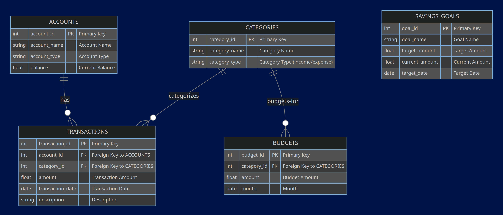

# Finance Tracker

## Scope

### Purpose of the Database

The database is designed to track and manage personal finance activities. It allows for monitoring of bank accounts, transactions, budgets, and savings goals.

### Inclusion Scope

* Accounts: Various types of financial accounts like checking, savings, and credit cards.
* Transactions: Individual financial transactions, linked to accounts and categories.
* Categories: Classification of transactions into income and expenses.
* Budgets: Monthly budget limits for different categories.
* Savings Goals: Tracking of savings targets and progress.

### Exclusion Scope

* Investment portfolios and stock market transactions.
* Multi-user functionalities (designed for a single user).
* Complex financial instruments like loans, mortgages, or retirement funds.

## Functional Requirements

### User Capabilities

* Add, update, and delete accounts, categories, transactions, budgets, and savings goals.
* View transaction history, budget status, and savings goal progress.
* Generate summary reports for expenses and incomes.

### Beyond Scope

* Real-time syncing with bank accounts.
* Automated bill payments or direct transaction importing.
* Financial advice or predictive financial modeling.

## Representation

### Entities

* Accounts: account_id, account_name, account_type, balance.
* Categories: category_id, category_name, category_type.
* Transactions: transaction_id, account_id, category_id, amount, transaction_date, description.
* Budgets: budget_id, category_id, amount, month.
* Savings Goals: goal_id, goal_name, target_amount, current_amount, target_date.

* Primary keys are integers with auto-increment for uniqueness.
* Foreign keys establish relationships and ensure referential integrity.
* Text fields for names and descriptions.
* Real/Float for financial amounts to accommodate decimals.
* Date types for time-specific entries.
* Check constraints for category types (income/expense).

### Relationships

* Accounts are linked to Transactions to track account-specific transactions.
* Categories are linked to Transactions to categorize each transaction.
* Categories are also linked to Budgets for budgeting purposes.
* Each Savings Goal is independent but tracks progress through transactions.

## Optimizations

* Indexes on account_id and category_id in the transactions table for faster query performance.
* Views like monthly_expenses_view and account_balances_view for easy and efficient data retrieval and reporting.

* Indexes improve query performance, especially for frequently accessed data.
* Views simplify complex queries and provide a user-friendly way to access reports.

## Limitations

### Design Limitations

* The database is not designed for multi-user environments.
* It lacks the capability for real-time financial data integration.
* Does not handle complex financial scenarios like investments or loans.

### Representational Limitations
* Might not efficiently represent historical data trends over extended periods.
* Limited in handling diverse financial instruments beyond basic income and expenses.
